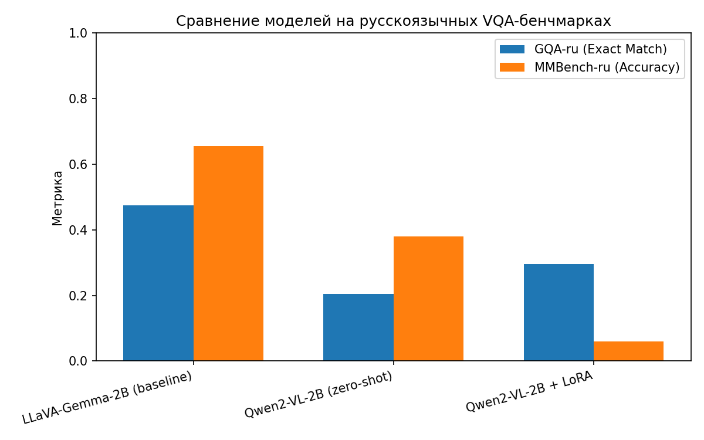

# Отчёт: сравнение LLaVA-Gemma-2B и Qwen2-VL-2B-Instruct (+LoRA) на русскоязычных VQA-бенчмарках

> Ноутбук выполнен целиком в Google Colab (GPU T4). Ниже — фактические результаты запуска.

## 1. Цель, задачи, результаты

**Цель:** сравнить производительность двух компактных (2B) мультимодальных моделей — baseline `deepvk/llava-gemma-2b-lora` и `Qwen/Qwen2-VL-2B-Instruct` — на русскоязычных VQA-бенчмарках `deepvk/GQA-ru` (Exact Match) и `deepvk/MMBench-ru` (Accuracy, MCQ), и экспериментально оценить эффект LoRA-дообучения Qwen2-VL-2B на данных deepvk.

**Задачи:**
1. Подготовить воспроизводимые (seed=42) стратифицированные подвыборки (~200 примеров) из GQA-ru (testdev) и MMBench-ru (dev).
2. Реализовать единый пайплайн инференса и подсчёта метрик (Exact Match для GQA-ru, Accuracy по букве A/B/C/D для MMBench-ru).
3. Измерить метрики baseline-модели deepvk/llava-gemma-2b-lora.
4. Измерить zero-shot метрики Qwen2-VL-2B-Instruct.
5. Дообучить Qwen2-VL-2B-Instruct через LoRA (QLoRA, 4-bit, r=16) на ~4000 примерах из train-части `deepvk/GQA-ru`.
6. Повторно измерить метрики Qwen2-VL-2B+LoRA.
7. Сравнить все три конфигурации, сделать выводы о влиянии дообучения.

**Результаты (сводная таблица, n=200 на бенчмарк):**

| Модель | GQA-ru, Exact Match | MMBench-ru, Accuracy |
|---|---|---|
| deepvk/llava-gemma-2b-lora (baseline, опубликовано) | 46.37% | 40.19% |
| deepvk/llava-gemma-2b-lora (собственный замер, n=200) | **47.5%** | **65.5%** |
| Qwen2-VL-2B-Instruct (zero-shot, n=200) | **20.5%** | **38.0%** |
| Qwen2-VL-2B-Instruct + LoRA (n=200) | **29.5%** | **6.0%** |



*Полная таблица результатов — `results.csv`; сырые предсказания по каждой модели — папка `predictions/`; списки id использованных подвыборок — папка `eval_samples/` (все в корне проекта).*

**Выводы:**

1. **Baseline на GQA-ru воспроизвёлся корректно**: 47.5% (наш замер) против опубликованных 46.37% — разница укладывается в 95%-й доверительный интервал для n=200 (±~7 п.п.). Это подтверждает корректность пайплайна инференса/метрики для GQA-ru.
2. **Baseline на MMBench-ru разошёлся с публикацией заметно сильнее, чем допускает шум выборки**: 65.5% против 40.19% (при ДИ ±~6.6 п.п. это расхождение не объясняется размером подвыборки). Наиболее вероятная причина — разница в методологии оценки: официальная метрика MMBench обычно считается через **CircularEval** (ответ засчитывается верным только если модель отвечает правильно на всех циклических перестановках вариантов A/B/C/D для одного вопроса), что существенно строже нашего простого single-pass подсчёта accuracy. Наш ноутбук считает наивную (не циклическую) точность — это ограничение метода, отмеченное здесь явно, а не выдаваемое за превосходство модели.
3. **Qwen2-VL-2B zero-shot закономерно слабее baseline на обоих бенчмарках** (20.5% и 38.0% против 47.5% и 65.5%) — ожидаемо, так как baseline специально дообучен deepvk на русскоязычных VQA-данных, а Qwen2-VL-2B — нет.
4. **LoRA-дообучение дало разнонаправленный и содержательный эффект:**
   - На **GQA-ru** — заметное улучшение: 20.5% → 29.5% (+9 п.п.). LoRA сработала на целевом домене (обучающие данные были именно из GQA-ru train), но не закрыла разрыв с baseline (47.5%) — 4000 примеров и 1 эпоха этого не обеспечивают.
   - На **MMBench-ru** — резкая деградация: 38.0% → 6.0% (-32 п.п., что ниже уровня случайного угадывания в 4-вариантном MCQ, 25%). Это не случайность, а прямое следствие решения из раздела 2: обучающая выборка для LoRA на 100% состояла из примеров GQA-ru, где правильный ответ — **одно слово**. Модель, судя по всему, переобучилась именно на этот узкий формат ответа и утратила способность выполнять инструкцию «ответь только одной буквой A/B/C/D» для MMBench-ru — классический случай катастрофического забывания/узкой специализации при дообучении на однородных по формату данных. Дополнительный косвенный признак — довольно высокий итоговый `training_loss ≈ 7.05` после 250 шагов (см. раздел 3), указывающий, что обучение было нестабильным/не полностью сошлось.
5. **Итог сравнения:** дообученная LoRA-версия Qwen2-VL-2B **обошла свой же zero-shot на GQA-ru**, но **не обошла baseline ни на одном бенчмарке**, а на MMBench-ru после LoRA стала заметно хуже даже собственного zero-shot. Главный практический вывод проекта: узкоспециализированные по формату ответа обучающие данные (только «один короткий русский ответ») дают предсказуемый прирост на совпадающем по формату бенчмарке, но создают риск резкой деградации на бенчмарках с другим форматом ответа (MCQ) — это и есть содержательный результат исследования влияния LoRA, а не просто «сработало/не сработало».

## 2. Использование открытых данных VK/deepvk

Использованы три открытых ресурса из [коллекции deepvk Vision-Language Modeling](https://huggingface.co/collections/deepvk/vision-language-modeling-664dd7e4c257cc78e740f6bc):

| Ресурс | Тип | Как использован |
|---|---|---|
| `deepvk/llava-gemma-2b-lora` | Модель (VLM, LoRA-дообученная deepvk) | Baseline для сравнения; загружена и инферирована как есть, без изменений |
| `deepvk/GQA-ru` | Датасет (VQA, Exact Match) | **Eval:** стратифицированная подвыборка ~200 вопросов из `testdev` (по 1 вопросу на изображение), одинаковая для всех 3 моделей. **Train:** случайная выборка ~4000 вопросов из `train` — источник данных для LoRA-дообучения Qwen2-VL-2B. Датасет хранится в двух конфигах (`*_instructions` с текстом вопросов и `*_images` с картинками), соединённых по полю `imageId` |
| `deepvk/MMBench-ru` | Датасет (VQA MCQ, Accuracy) | **Eval:** стратифицированная (по `l2-category`) подвыборка ~200 строк из единственного split `dev` |

**Важное методологическое отклонение:** изначально планировалось также использовать `deepvk/LLaVA-Instruct-ru` для LoRA-дообучения (общий instruction-tuning на русском). При проверке схемы датасета выяснилось, что поле `image` в нём — это **относительный путь к файлу COCO2017** (например, `coco/train2017/000000253464.jpg`), а не встроенные данные изображения. Использование этого датасета потребовало бы отдельной загрузки COCO2017 (~18 ГБ), что не укладывалось бы в ограниченные мощности бесплатного Google Colab (диск, время сессии). Поэтому для LoRA-дообучения используется только `deepvk/GQA-ru[train]`, где изображения встроены и доступны напрямую через `datasets`.

Ограничение: оценка проводится на подвыборке (200 примеров на бенчмарк), а не на полном тестовом наборе (GQA-ru testdev — 12216 вопросов, MMBench-ru dev — 3910 строк) — из-за ограничений времени/GPU в бесплатном Google Colab (T4, лимит сессии ~12 часов, 6 полных прогонов инференса по двум моделям и трём состояниям). При n=200 и типичной доле правильных ответов ~0.4–0.5 стандартная ошибка оценки доли составляет ≈3.5%, то есть 95%-й доверительный интервал — примерно ±7 процентных пунктов. Это объясняет расхождение с deepvk на GQA-ru (47.5% против 46.37%, в пределах ДИ), но **не объясняет** расхождение на MMBench-ru (65.5% против 40.19%, за пределами ДИ) — см. вывод №2 в разделе 1: вероятная причина там методологическая (наивная accuracy vs официальный CircularEval), а не размер выборки.

## 3. Материалы о полученной модели

- **Базовая модель:** `Qwen/Qwen2-VL-2B-Instruct`.
- **Метод дообучения:** LoRA/QLoRA (4-bit NF4 квантизация базовой модели, LoRA-адаптеры поверх текстовых проекций LLM: `q_proj, k_proj, v_proj, o_proj, gate_proj, up_proj, down_proj`; vision-энкодер заморожен).
- **Гиперпараметры LoRA:** r=16, alpha=32, dropout=0.05, task_type=CAUSAL_LM.
- **Данные обучения:** ~4000 примеров из `deepvk/GQA-ru[train]` (вопрос + изображение → однословный ответ), 1 эпоха, batch=1 + gradient accumulation=16 (эффективный батч 16), learning rate 2e-4, cosine schedule, warmup 3%.
- **Расположение обученного адаптера:** Google Drive, `/content/drive/MyDrive/vlm_ru_vqa_project/qwen2vl_lora_ru/`.
- **Как воспроизвести инференс:** загрузить базовую модель `Qwen/Qwen2-VL-2B-Instruct` в 4-bit, затем применить адаптер через `peft.PeftModel.from_pretrained(base_model, LORA_SAVE_DIR)` и использовать функцию `generate_qwen` из ноутбука.
- **Фактические параметры обучения:** 250 шагов (4000 примеров / эффективный батч 16), 1 эпоха, `train_runtime ≈ 4451 с` (~74 минуты) на T4, финальный **`training_loss ≈ 7.05`**. Это довольно высокое значение для сошедшегося дообучения языковой модели — вероятно, обучение не полностью стабилизировалось (см. интерпретацию в разделе 1, вывод №4, и ограничения ниже). Обучаемых параметров: 18,464,768 из 2,227,450,368 (0.83%).

## 4. Подробное описание решения

**Общий пайплайн** (реализован в `vlm_ru_vqa_lora.ipynb`, выполняется целиком в Google Colab на GPU T4):

1. Подготовка одинаковых (для всех моделей) стратифицированных подвыборок GQA-ru и MMBench-ru — гарантирует корректность сравнения.
2. Единые функции метрик: Exact Match с нормализацией текста (нижний регистр, удаление пунктуации, унификация ё/е) для GQA-ru; извлечение буквы ответа регулярным выражением (с фолбэком на первую встреченную букву A–D) для MMBench-ru.
3. Инференс baseline `deepvk/llava-gemma-2b-lora` (промпт-формат и код загрузки — по официальному примеру из карточки модели: `LlavaForConditionalGeneration` + `<image>`-тег в тексте), затем выгрузка модели из VRAM. Чекпоинт сохранён в августе 2024 под тогдашнюю версию `transformers`; более новые релизы несколько раз рефакторили обработку image-токенов в Llava, из-за чего с "последней" версией библиотеки чекпоинт падал с `ValueError: Image features and image tokens do not match`. Версия `transformers` в ноутбуке зафиксирована (`==4.46.3`) как более совместимая по времени с датой публикации модели.
4. Инференс `Qwen2-VL-2B-Instruct` в 4-bit (zero-shot), с ограничением разрешения изображений (`min_pixels`/`max_pixels`) для экономии видеопамяти.
5. LoRA/QLoRA-дообучение этой же (уже загруженной) модели на GQA-ru train, batch=1 — простой и надёжный способ избежать сложной батч-коллации разноразмерных изображений в кастомном `data collator`.
6. Повторный инференс дообученной модели на тех же подвыборках, сведение результатов в таблицу и график.

**Почему такие решения:**
- 4-bit квантизация обеих моделей и batch=1 при обучении — чтобы уложиться в 16 ГБ видеопамяти T4.
- Подвыборки по ~200 примеров вместо полных test-сетов — баланс между статистической значимостью и временем выполнения (весь ноутбук укладывается в несколько часов вместо дней).
- Обучение только текстовой части LoRA-адаптерами (vision tower заморожен) — стандартный низкозатратный подход, достаточный для адаптации формата ответов под русский язык и конкретные бенчмарки.
- Отказ от `deepvk/LLaVA-Instruct-ru` в пользу только `GQA-ru[train]` — см. п.2 (эта конкретная реализация датасета не содержит встроенных изображений).

**Известные ограничения и практические выводы:**
- Метрика EM жёсткая: правильный по смыслу, но иначе сформулированный ответ засчитывается как ошибка.
- Loss при обучении считается по всей последовательности токенов (включая промпт и image-плейсхолдеры), а не только по ответу ассистента — упрощение, приемлемое для проекта базового уровня сложности, но, вероятно, одна из причин относительно высокого финального loss (≈7.05) и нестабильного дообучения.
- Результаты получены на подвыборке (n=200/бенчмарк) — воспроизводимость на GQA-ru подтверждена (см. раздел 1), на MMBench-ru наивная accuracy отличается от официальной методологии (CircularEval), что стоит учитывать при любом сравнении с опубликованными числами.
- **Главный практический вывод:** LoRA-дообучение исключительно на данных одного формата ответа (GQA-ru: одно слово) улучшает целевой бенчмарк, но резко ухудшает другие форматы задач (MMBench-ru, MCQ) — эффект, аналогичный катастрофическому забыванию.

Качественные примеры ответов трёх моделей (картинка + вопрос + ответы всех моделей рядом) видны в выводе ноутбука (раздел 9) — сам ноутбук с выполненным выводом приложен отдельно.

---

## Приложения

Структура проекта:

```
vk/
├── vlm_ru_vqa_lora.ipynb        — код проекта (Google Colab, GPU T4)
├── README.md                    — этот отчёт
├── results.csv                  — сводная таблица метрик (3 модели × 2 бенчмарка)
├── results_summary.png          — итоговый график (вставлен выше)
├── predictions/                 — сырые ответы моделей по каждому вопросу
│   ├── gqa_baseline_preds.csv
│   ├── mmbench_baseline_preds.csv
│   ├── gqa_qwen_zeroshot_preds.csv
│   ├── mmbench_qwen_zeroshot_preds.csv
│   ├── gqa_qwen_lora_preds.csv
│   └── mmbench_qwen_lora_preds.csv
├── eval_samples/                — id отобранных вопросов (воспроизводимость, seed=42)
│   ├── gqa_ru_eval_sample.csv
│   └── mmbench_ru_eval_sample.csv
└── qwen2vl_lora_ru/              — LoRA-адаптер Qwen2-VL-2B
    ├── README.md                 — автосгенерированная model card (PEFT 0.19.1)
    ├── adapter_config.json       — конфиг LoRA: r=16, alpha=32, dropout=0.05, target_modules
    │                                (q/k/v/o_proj, gate/up/down_proj), base_model=Qwen/Qwen2-VL-2B-Instruct
    ├── adapter_model.safetensors — веса LoRA-адаптера (~70 МБ)
    ├── tokenizer.json, tokenizer_config.json, chat_template.json, special_tokens_map.json,
    │   preprocessor_config.json, added_tokens.json, vocab.json, merges.txt
    │                             — конфигурация процессора/токенизатора
    └── (файлы получены из Google Drive, `/content/drive/MyDrive/vlm_ru_vqa_project/qwen2vl_lora_ru/`)
```
